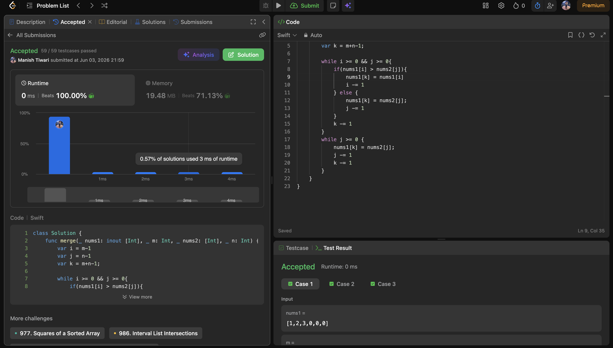
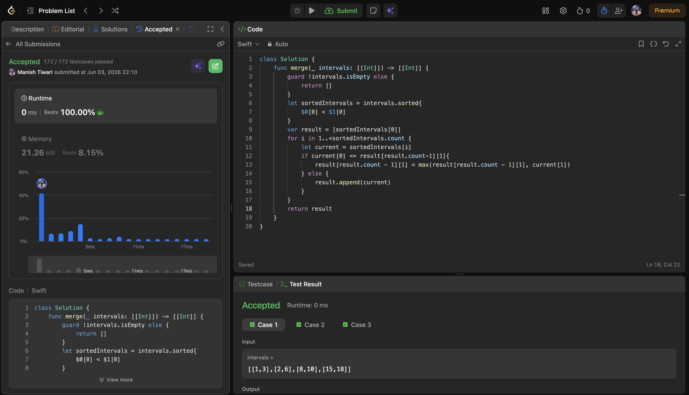
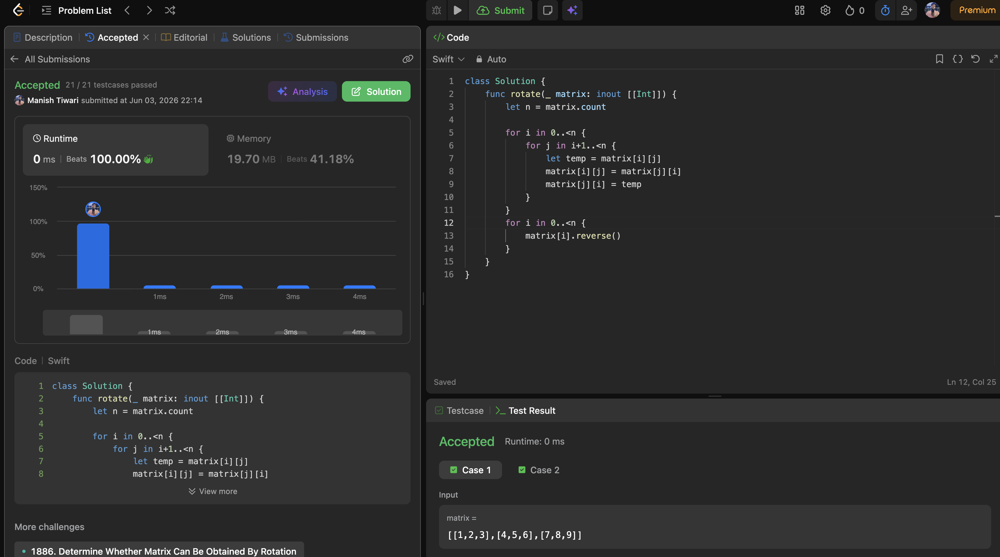

# Day 03

📅 Date: 3 June 2026

## Problems Solved

### 1. Merge Sorted Array

**Platform:** LeetCode

**Difficulty:** Easy

### Approach

Used three pointers starting from the end of both arrays.

Since nums1 already contains extra space at the back, placing larger elements from right to left avoids overwriting useful values.

### Complexity

* Time Complexity: O(m + n)
* Space Complexity: O(1)

### Key Learning

When an array contains extra space, processing from the end can often simplify in-place modifications.

---

### 2. Merge Intervals

**Platform:** LeetCode

**Difficulty:** Medium

### Approach

Sorted intervals based on their starting values.

Traversed the sorted intervals and merged overlapping intervals by updating the ending boundary whenever an overlap was detected.

### Complexity

* Time Complexity: O(n log n)
* Space Complexity: O(n)

### Key Learning

Sorting frequently transforms interval problems into straightforward greedy solutions.

---

### 3. Rotate Image

**Platform:** LeetCode

**Difficulty:** Medium

### Approach

Instead of rotating elements directly:

1. Transposed the matrix.
2. Reversed each row.

This achieves a 90-degree clockwise rotation in-place.

### Complexity

* Time Complexity: O(n²)
* Space Complexity: O(1)

### Key Learning

Complex matrix transformations often become easier when broken into smaller operations such as transpose and reverse.

---

## Concepts Practiced

✔ Two Pointer Technique

✔ Sorting

✔ Greedy Algorithms

✔ Matrix Manipulation

✔ In-place Transformation

✔ Interval Processing

✔ Array Operations

---

## Language Experiment

For Day 3, I chose Swift instead of Java to strengthen language flexibility while continuing my DSA practice.

This helped me focus on understanding algorithms independent of programming language syntax.

---

## Day Summary

Today's problems covered three very common interview patterns:

* Two Pointers
* Sorting + Greedy
* Matrix Manipulation

The most valuable takeaway was realizing how many seemingly complex problems become simple once the correct transformation or pattern is identified.

---

## Statistics

Problems Solved Today: 3

Total Problems Solved So Far: 9

Days Completed: 3/45

---

## Screenshots

### Merge Sorted Array

### Merge Intervals

### Rotate Image

