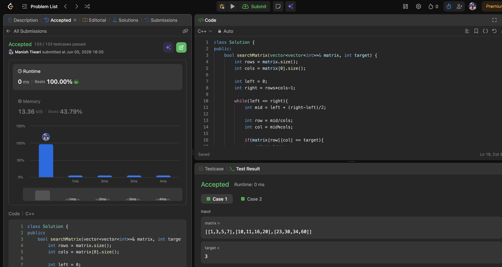
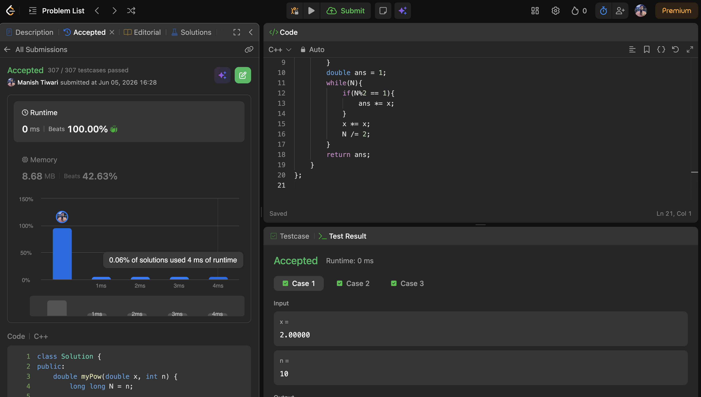
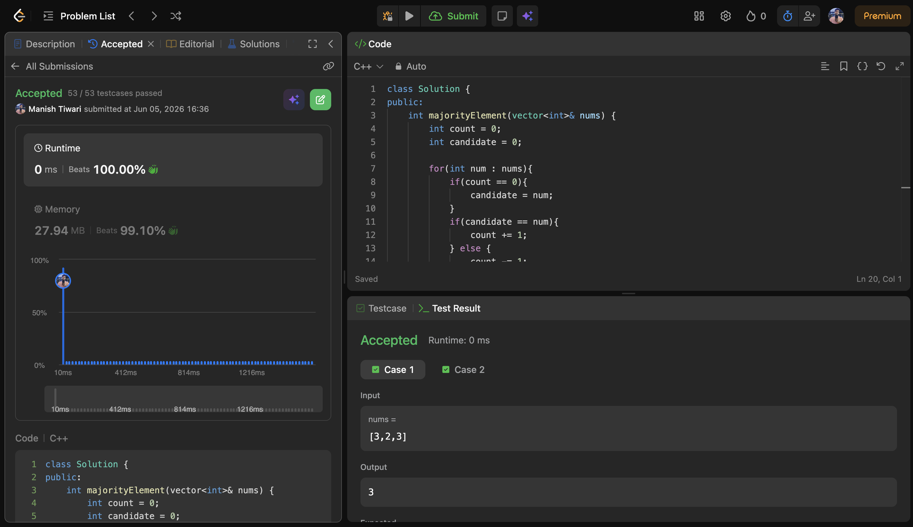

# Day 05

📅 Date: 5 June 2026

## Problems Solved

### 1. Search a 2D Matrix

**Platform:** LeetCode

**Difficulty:** Medium

### Approach

Instead of performing binary search on each row separately, treated the matrix as a virtual sorted 1D array.

Mapped indices using:

* row = mid / cols
* col = mid % cols

Performed a single binary search over the entire matrix.

### Complexity

* Time Complexity: O(log(m × n))
* Space Complexity: O(1)

### Key Learning

A 2D matrix can sometimes be viewed as a flattened 1D structure, enabling direct application of binary search.

---

### 2. Pow(x, n)

**Platform:** LeetCode

**Difficulty:** Medium

### Approach

Used Binary Exponentiation (Fast Power).

Instead of multiplying x repeatedly n times:

* If exponent is odd → multiply answer by x
* Square x
* Halve the exponent

This reduces the number of operations dramatically.

### Complexity

* Time Complexity: O(log n)
* Space Complexity: O(1)

### Key Learning

Repeated squaring is a powerful optimization technique that appears frequently in mathematics and competitive programming.

---

### 3. Majority Element

**Platform:** LeetCode

**Difficulty:** Easy

### Approach

Initially understood the HashMap solution by counting frequencies.

Then optimized using Moore's Voting Algorithm:

* Maintain a candidate
* Maintain a count
* Cancel out different elements

The majority element survives due to its frequency being greater than n/2.

### Complexity

* Time Complexity: O(n)
* Space Complexity: O(1)

### Key Learning

Special properties of a problem can sometimes eliminate the need for additional memory.

---

## Concepts Practiced

✔ Binary Search

✔ Matrix Index Mapping

✔ Binary Exponentiation

✔ Bit-Level Thinking

✔ HashMap Frequency Counting

✔ Moore's Voting Algorithm

✔ Space Optimization

---

## Day Summary

Today's problems highlighted how recognizing mathematical and structural patterns can lead to substantial optimizations.

The biggest takeaway was understanding how:

* A matrix can be treated as a 1D array.
* Exponentiation can be reduced from O(n) to O(log n).
* Frequency counting can be reduced from O(n) space to O(1) space.

These optimizations demonstrate how algorithmic thinking often matters more than implementation details.

---

## Statistics

Problems Solved Today: 3

Total Problems Solved So Far: 15

Days Completed: 5/45

---

## Screenshots

### Search a 2D Matrix

### Pow(x, n)

### Majority Element

