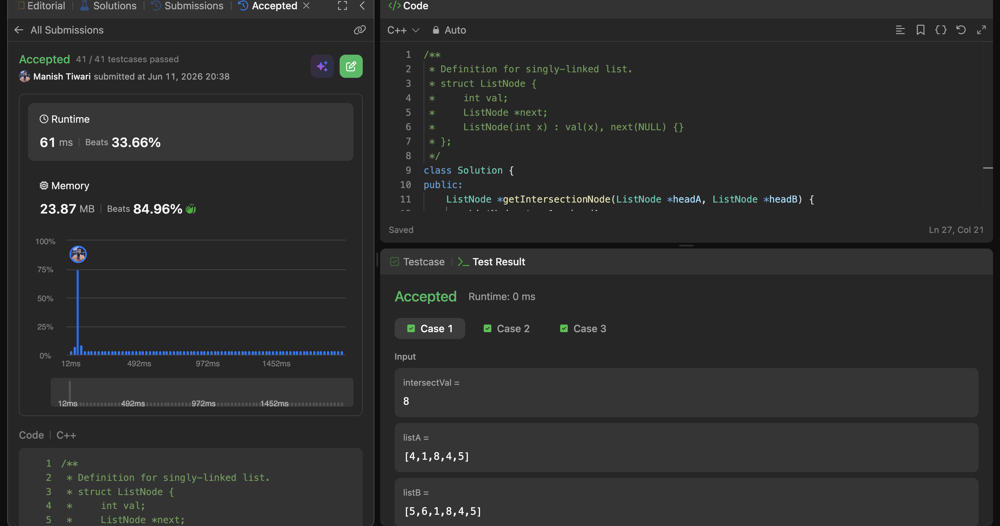
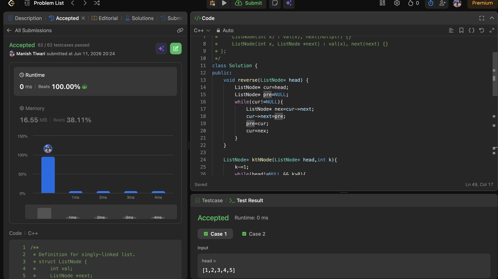
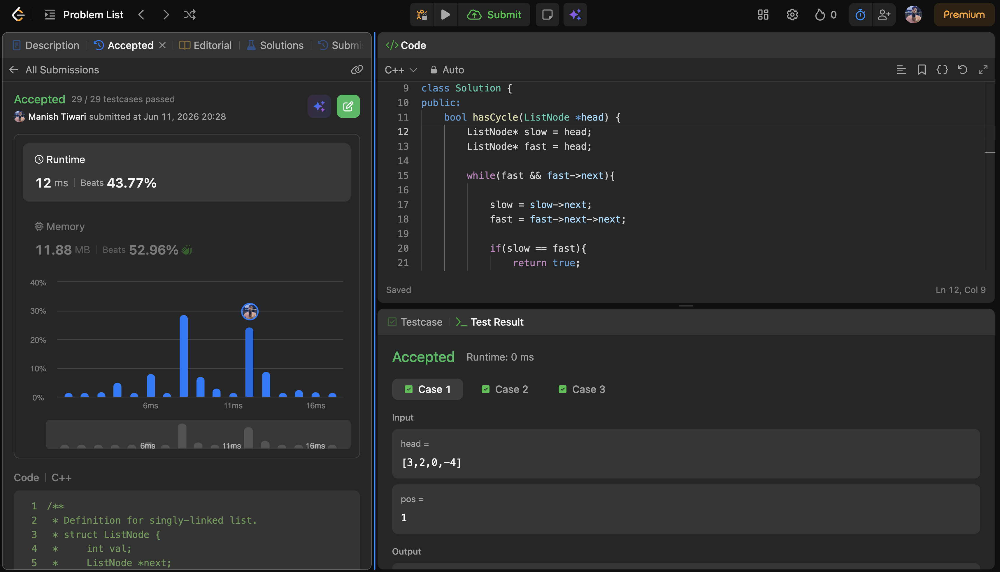

# Day 11

📅 Date: 11 June 2026

## Problems Solved

### 1. Intersection of Two Linked Lists

**Platform:** LeetCode

**Difficulty:** Easy

### Approach

Explored multiple approaches including brute force and hashing.

The optimal solution used pointer switching:

- Pointer A traverses List A and then List B.
- Pointer B traverses List B and then List A.

Both pointers travel the same total distance and eventually meet at the intersection node.

### Complexity

- Time Complexity: O(m + n)
- Space Complexity: O(1)

### Key Learning

Equalizing the total distance traveled can eliminate the need for explicit length calculations.

---

### 2. Reverse Nodes in K-Group

**Platform:** LeetCode

**Difficulty:** Hard

### Approach

Used in-place linked list reversal.

For each group:

1. Locate the kth node.
2. Reverse the current group.
3. Reconnect the reversed group with the remaining list.
4. Continue with the next group.

If fewer than k nodes remain, they are left unchanged.

### Complexity

- Time Complexity: O(n)
- Space Complexity: O(1)

### Key Learning

Many advanced linked list problems are built on top of the basic linked list reversal pattern.

---

### 3. Linked List Cycle

**Platform:** LeetCode

**Difficulty:** Easy

### Approach

Applied Floyd's Cycle Detection Algorithm.

Maintained:

- Slow Pointer (1 step)
- Fast Pointer (2 steps)

If a cycle exists, the fast pointer eventually catches the slow pointer.

### Complexity

- Time Complexity: O(n)
- Space Complexity: O(1)

### Key Learning

Cycle detection can be achieved without extra memory by leveraging relative pointer speeds.

---

## Concepts Practiced

✔ Pointer Switching

✔ Floyd's Cycle Detection

✔ Fast & Slow Pointers

✔ In-place Linked List Reversal

✔ Group Reversal

✔ Constant Space Optimization

✔ Linked List Traversal

---

## Day Summary

Today's problems focused heavily on understanding pointer movement and linked list structure.

The most valuable takeaway was seeing how a few core techniques:

- Fast & Slow Pointers
- Pointer Switching
- Linked List Reversal

can solve a wide variety of seemingly different problems.

Reverse Nodes in K-Group was particularly interesting because it combines multiple linked list concepts into one problem.

---

## Statistics

Problems Solved Today: 3

Total Problems Solved So Far: 33

Days Completed: 11/45

---

## Screenshots

### Intersection of Two Linked Lists

### Reverse Nodes in K-Group

### Linked List Cycle

