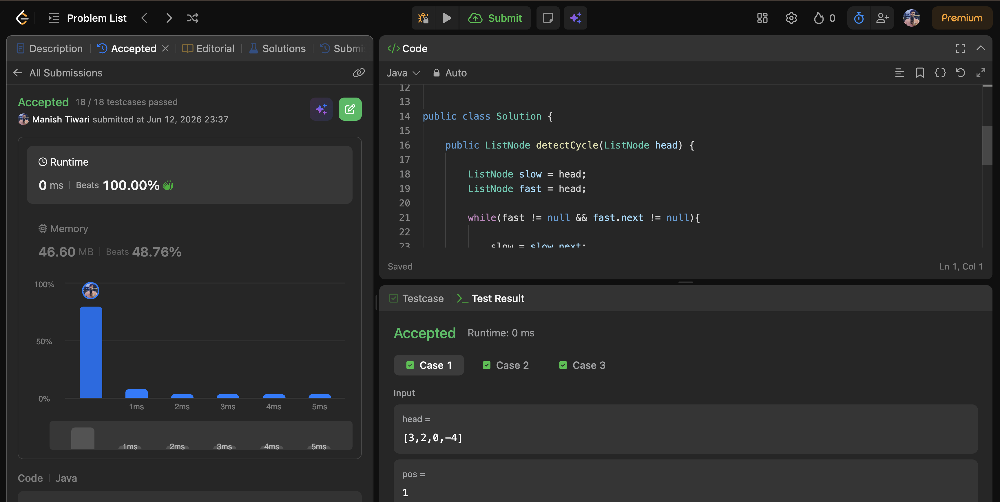
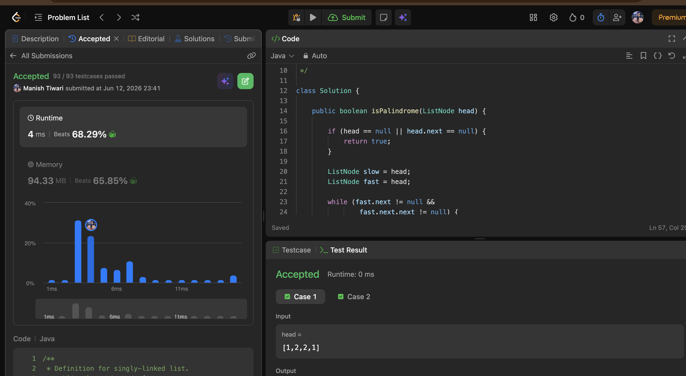
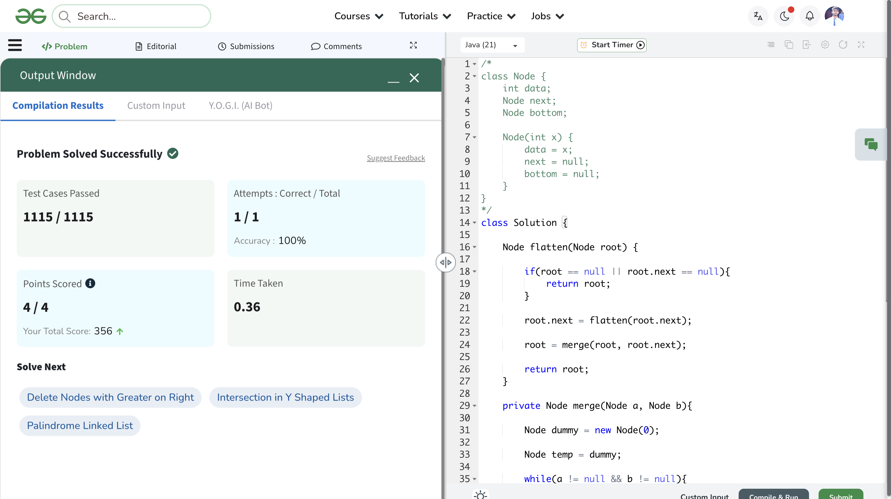

# Day 12

📅 Date: 12 June 2026

## Problems Solved

### 1. Linked List Cycle II

**Platform:** LeetCode

**Difficulty:** Medium

### Approach

Used Floyd's Cycle Detection Algorithm.

Step 1:
- Detect whether a cycle exists using Fast and Slow pointers.

Step 2:
- Once both pointers meet, move one pointer back to the head.
- Move both pointers one step at a time.
- The node where they meet again is the starting point of the cycle.

### Complexity

- Time Complexity: O(n)
- Space Complexity: O(1)

### Key Learning

The mathematical relationship inside Floyd's algorithm helps locate the exact starting node of the cycle without extra memory.

---

### 2. Palindrome Linked List

**Platform:** LeetCode

**Difficulty:** Easy

### Approach

1. Find the middle of the linked list using Fast and Slow pointers.
2. Reverse the second half of the linked list.
3. Compare both halves node by node.

If all corresponding nodes match, the linked list is a palindrome.

### Complexity

- Time Complexity: O(n)
- Space Complexity: O(1)

### Key Learning

Reversing the second half of a linked list is a common optimization pattern for achieving constant space solutions.

---

### 3. Flattening a Linked List

**Platform:** Striver SDE Sheet

**Difficulty:** Medium

### Approach

Each vertical linked list is already sorted.

Used recursion to:
- Flatten the right side first.
- Merge the current linked list with the already flattened list.

This approach is similar to merging multiple sorted linked lists.

### Complexity

- Time Complexity: O(N × M)
- Space Complexity: O(N) (Recursion Stack)

### Key Learning

Many linked list problems can be transformed into merge problems when sorted structures are involved.

---

## Concepts Practiced

✔ Floyd's Cycle Detection

✔ Cycle Entry Point

✔ Fast & Slow Pointers

✔ Reverse Linked List

✔ Palindrome Checking

✔ Recursive Linked List Processing

✔ Merge Sorted Lists

✔ Flatten Linked List

---

## Day Summary

Today's problems focused on advanced linked list manipulation and pointer-based problem solving.

The most valuable takeaway was understanding how a few core linked list techniques:

- Fast & Slow Pointers
- Linked List Reversal
- Recursive Merging

can be combined to solve significantly more complex problems.

---

## Statistics

Problems Solved Today: 3

Total Problems Solved So Far: 36

Days Completed: 12/45

---

## Screenshots

### Linked List Cycle II

### Palindrome Linked List

### Flattening a Linked List

