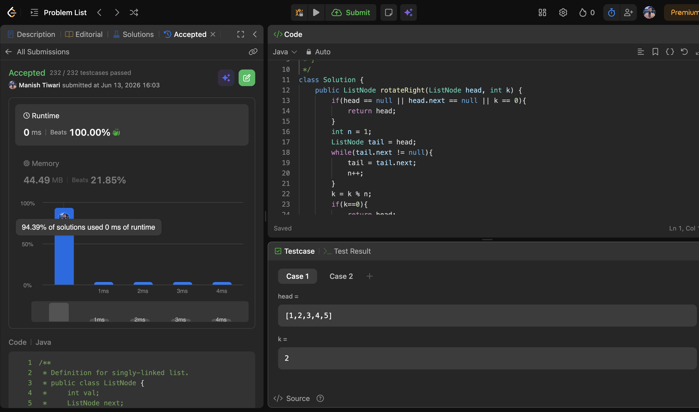
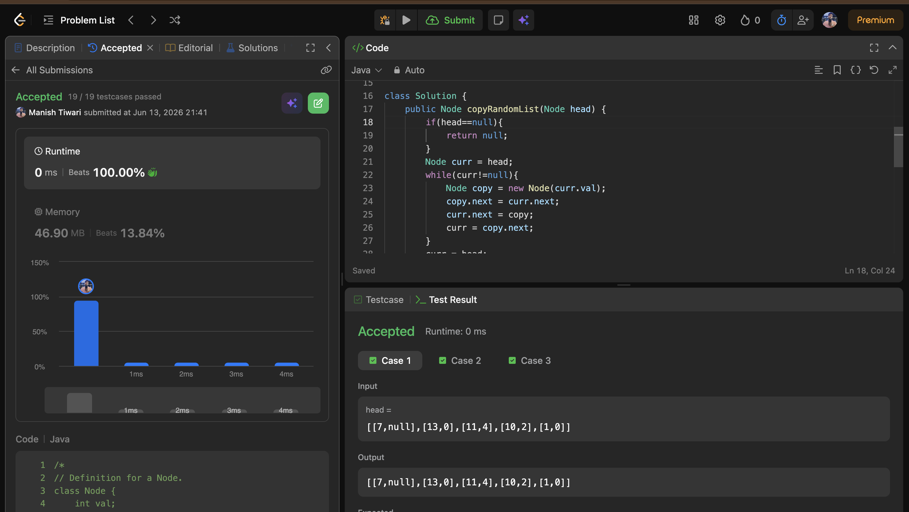
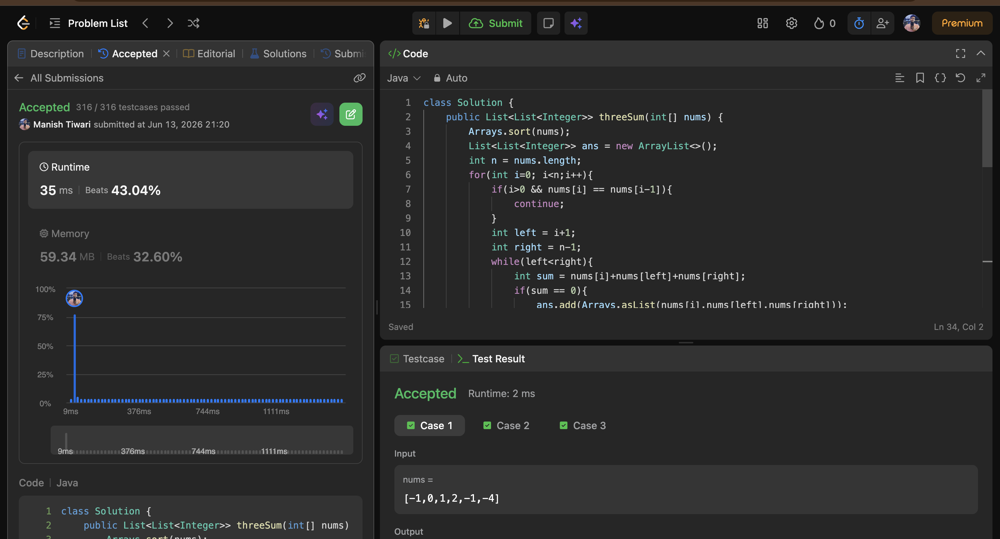

# Day 13

📅 Date: 13 June 2026

## Problems Solved

### 1. Rotate Linked List

**Platform:** LeetCode

**Difficulty:** Medium

### Approach

Started by considering repeatedly moving the last node to the front, but that results in unnecessary traversals.

The optimal approach:

1. Find the length of the linked list.
2. Compute the effective rotation using k % length.
3. Convert the linked list into a circular linked list.
4. Locate the new tail node.
5. Break the circular connection and return the new head.

### Complexity

- Time Complexity: O(n)
- Space Complexity: O(1)

### Key Learning

Transforming a linked list into a circular structure can simplify rotation problems significantly.

---

### 2. Copy List with Random Pointer

**Platform:** LeetCode

**Difficulty:** Medium

### Approach

Explored the HashMap solution first where each original node maps to its clone.

The optimal solution avoids extra space:

1. Insert cloned nodes between original nodes.
2. Assign random pointers using the interwoven structure.
3. Separate the original and cloned lists.

### Complexity

- Time Complexity: O(n)
- Space Complexity: O(1)

### Key Learning

Sometimes modifying the original structure temporarily helps eliminate the need for additional memory.

---

### 3. 3 Sum

**Platform:** LeetCode

**Difficulty:** Medium

### Approach

Started with the brute-force three-loop solution.

Optimized using:

1. Sorting the array.
2. Fixing one element.
3. Using the Two Pointer technique on the remaining portion.
4. Skipping duplicates to avoid repeated triplets.

### Complexity

- Time Complexity: O(n²)
- Space Complexity: O(1)

### Key Learning

Many multi-sum problems can be reduced to Two Sum after sorting.

---

## Concepts Practiced

✔ Circular Linked Lists

✔ Two Pointers

✔ Sorting

✔ Duplicate Handling

✔ Deep Copy

✔ Random Pointer Manipulation

✔ In-place Optimization

✔ Multi-Sum Problems

---

## Day Summary

Today's problems focused on transforming data structures and reusing previously learned patterns.

The biggest takeaway was understanding how:

- Circular linked lists simplify rotations.
- Interweaving nodes enables deep copying without extra memory.
- Two Sum can be extended into 3 Sum through sorting and pointer movement.

These techniques frequently appear in medium and hard interview questions.

---

## Statistics

Problems Solved Today: 3

Total Problems Solved So Far: 39

Days Completed: 13/45

---

## Screenshots

### Rotate Linked List

### Copy List with Random Pointer

### 3 Sum

