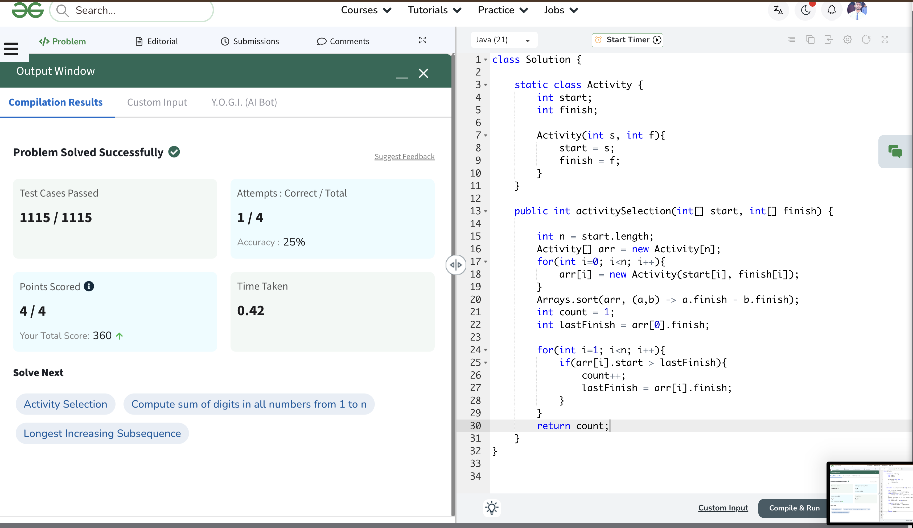
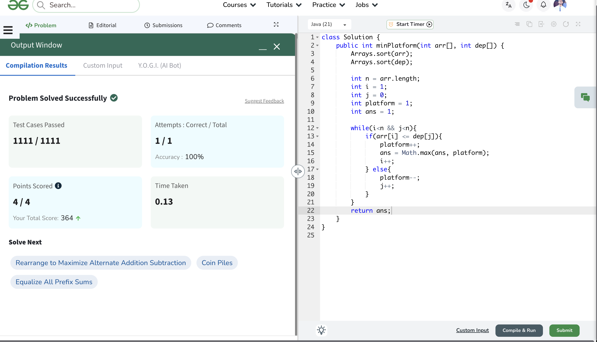
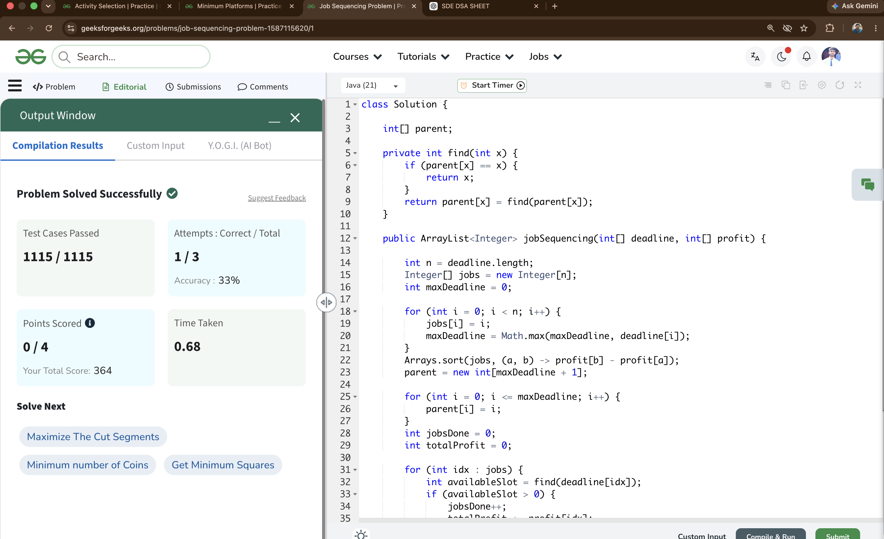

# Day 15

📅 Date: 15 June 2026

## Problems Solved

### 1. Activity Selection

**Platform:** GeeksforGeeks

**Difficulty:** Medium

### Approach

Created activity pairs consisting of start time and finish time.

Sorted activities based on finish time in ascending order.

Selected the first activity and greedily picked the next activity whose start time was strictly greater than the finish time of the previously selected activity.

### Complexity

- Time Complexity: O(n log n)
- Space Complexity: O(n)

### Key Learning

Choosing the activity that finishes earliest leaves maximum room for future activities.

---

### 2. Minimum Platforms

**Platform:** GeeksforGeeks

**Difficulty:** Medium

### Approach

Sorted arrival and departure times separately.

Used two pointers:

- Arrival Pointer
- Departure Pointer

Whenever a train arrived before the earliest departure, an additional platform was required.

Tracked the maximum number of simultaneously occupied platforms.

### Complexity

- Time Complexity: O(n log n)
- Space Complexity: O(1)

### Key Learning

Many interval scheduling problems can be solved efficiently after sorting event times.

---

### 3. Job Sequencing Problem

**Platform:** GeeksforGeeks

**Difficulty:** Medium

### Approach

Sorted jobs by profit in descending order.

Used the Greedy strategy of scheduling the most profitable job first.

Implemented the optimized DSU (Disjoint Set Union) approach to efficiently locate the latest available slot before a job's deadline.

Scheduled jobs while maximizing both:

- Number of jobs completed
- Total profit earned

### Complexity

- Time Complexity: O(n log n)
- Space Complexity: O(maxDeadline)

### Key Learning

Greedy algorithms become significantly more efficient when combined with suitable data structures such as Union Find.

---

## Concepts Practiced

✔ Greedy Algorithms

✔ Sorting

✔ Interval Scheduling

✔ Two Pointers

✔ Event Processing

✔ Job Scheduling

✔ Disjoint Set Union (DSU)

✔ Profit Maximization

---

## Day Summary

Today's problems focused entirely on Greedy Algorithms.

The most important realization was that making the locally optimal choice can lead to a globally optimal solution when the greedy property holds.

Key patterns learned:

- Earliest Finish Time First
- Chronological Event Processing
- Highest Profit First
- Slot Allocation using DSU

These are among the most frequently asked Greedy interview problems.

---

## Statistics

Problems Solved Today: 3

Total Problems Solved So Far: 45

Days Completed: 15/45

---

## Screenshots

### Activity Selection

### Minimum Platforms

### Job Sequencing Problem

