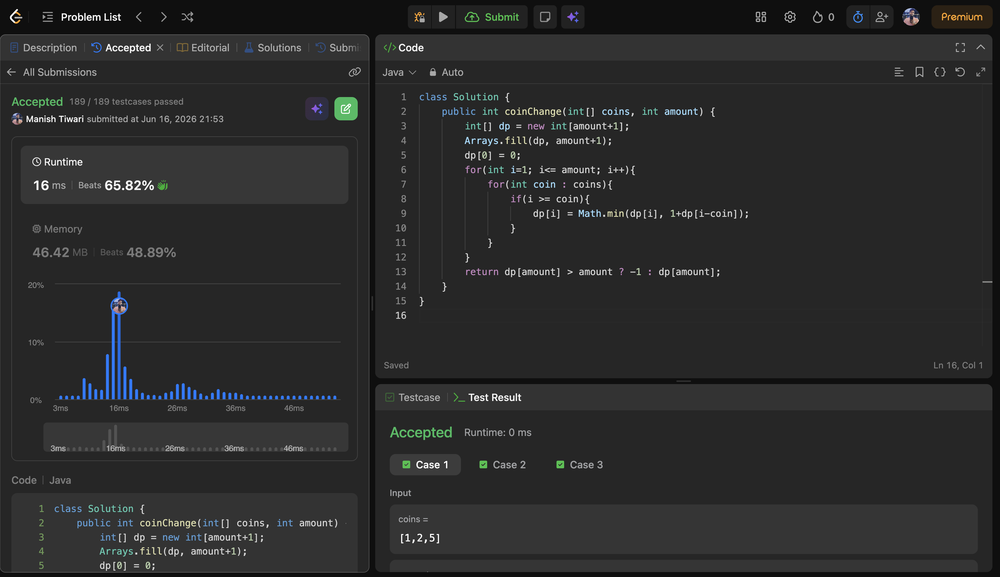
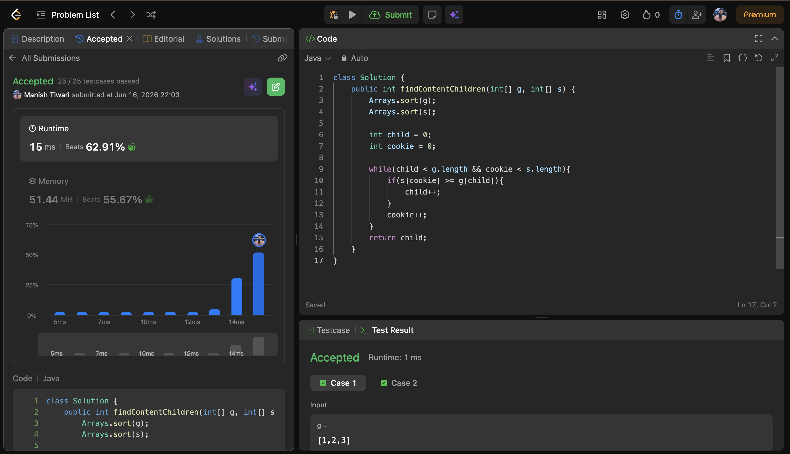
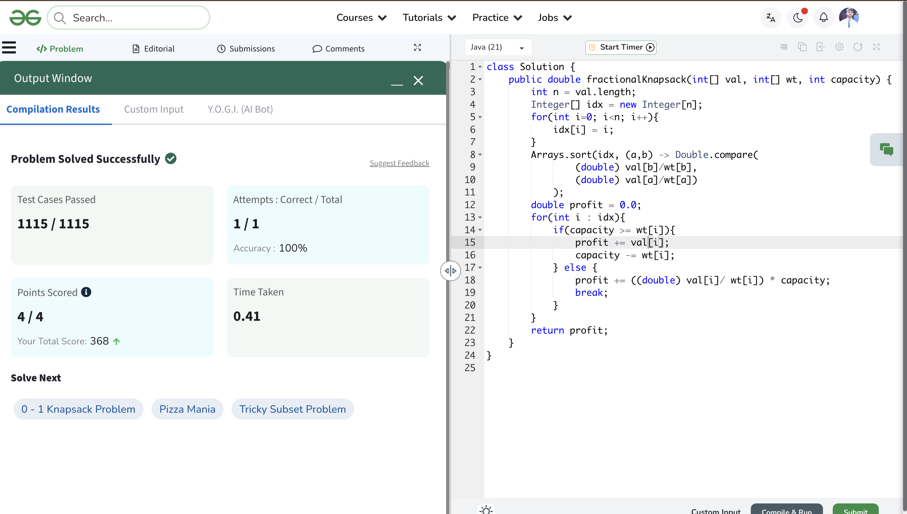

# Day 16

📅 Date: 16 June 2026

## Problems Solved

### 1. Coin Change

**Platform:** LeetCode

**Difficulty:** Medium

### Approach

Initially explored the greedy approach of always selecting the largest possible coin.

However, greedy fails for certain cases because choosing the locally optimal coin does not always produce the globally optimal answer.

Used Dynamic Programming:

- dp[i] represents the minimum number of coins needed to make amount i.
- For every amount, tried all available coins.
- Chose the minimum possible answer.

### Complexity

- Time Complexity: O(amount × n)
- Space Complexity: O(amount)

### Key Learning

Not every optimization problem can be solved using Greedy. Coin Change is a classic Dynamic Programming problem.

---

### 2. Assign Cookies

**Platform:** LeetCode

**Difficulty:** Easy

### Approach

Sorted both arrays:

- Greed Factors
- Cookie Sizes

Used two pointers:

- Child Pointer
- Cookie Pointer

Assigned the smallest valid cookie to each child while maximizing the number of satisfied children.

### Complexity

- Time Complexity: O(n log n)
- Space Complexity: O(1)

### Key Learning

Greedy works when assigning the smallest sufficient resource to satisfy the current requirement.

---

### 3. Fractional Knapsack

**Platform:** GeeksforGeeks

**Difficulty:** Medium

### Approach

Calculated value-to-weight ratio for each item.

Sorted items in descending order of ratio.

For each item:

- Took the whole item if capacity allowed.
- Otherwise took only the required fraction.

### Complexity

- Time Complexity: O(n log n)
- Space Complexity: O(1)

### Key Learning

Fractional Knapsack works greedily because items can be divided into fractions.

---

## Concepts Practiced

✔ Greedy Algorithms

✔ Dynamic Programming

✔ Sorting

✔ Two Pointers

✔ Resource Allocation

✔ Value/Weight Ratio

✔ Optimization Problems

✔ Decision Making Strategies

---

## Day Summary

Today's problems highlighted an important distinction between Greedy and Dynamic Programming.

While Assign Cookies and Fractional Knapsack can be solved optimally using Greedy decisions, Coin Change requires Dynamic Programming because local choices do not always lead to the best global answer.

Key patterns reinforced:

- Greedy Resource Allocation
- Ratio-Based Selection
- DP State Transition

---

## Statistics

Problems Solved Today: 3

Total Problems Solved So Far: 48

Days Completed: 16/45

---

## Screenshots

### Coin Change

### Assign Cookies

### Fractional Knapsack

