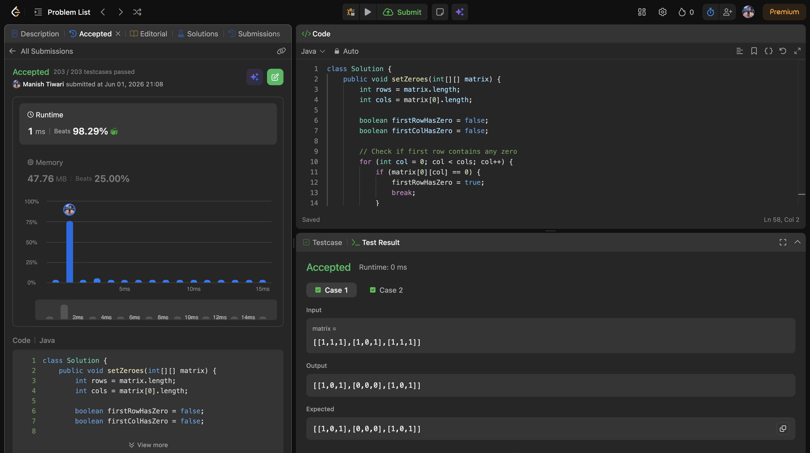
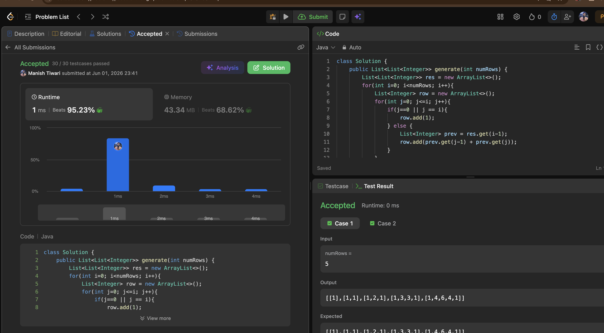
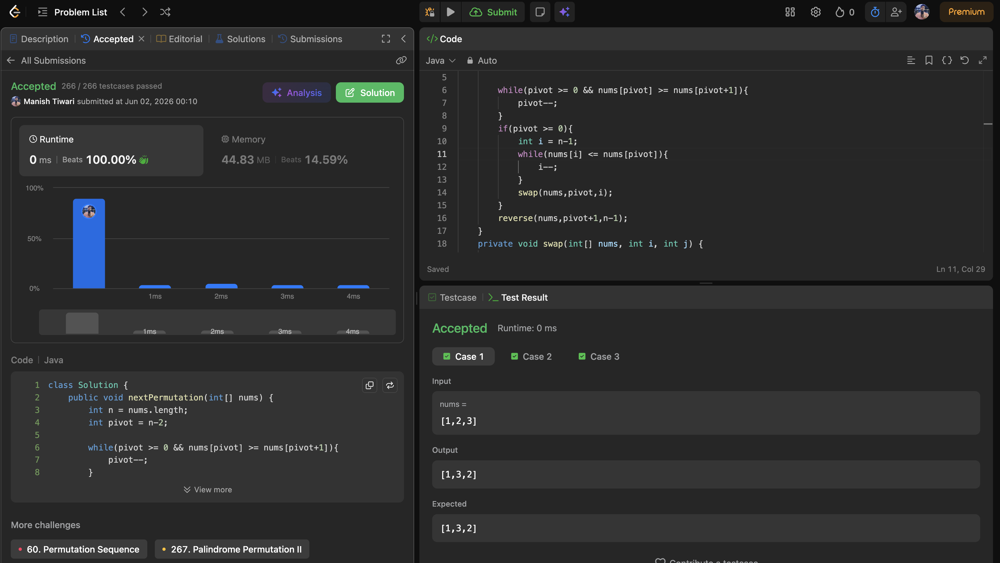

# Day 01

📅 Date: 1 June 2026

## Problems Solved

### 1. Set Matrix Zeroes

**Platform:** LeetCode

**Difficulty:** Medium

### Approach

Used the first row and first column of the matrix as markers to achieve O(1) extra space.

1. Check whether first row or first column contains a zero.
2. Traverse the remaining matrix and mark corresponding row and column.
3. Update cells using markers.
4. Finally process first row and first column separately.

### Complexity

* Time Complexity: O(m × n)
* Space Complexity: O(1)

### Key Learning

The matrix itself can be used as auxiliary storage, reducing extra space requirements significantly.

---

### 2. Pascal's Triangle

**Platform:** LeetCode

**Difficulty:** Easy

### Approach

Generated rows iteratively.

* First and last element of every row is 1.
* Middle elements are calculated using values from the previous row.

### Complexity

* Time Complexity: O(n²)
* Space Complexity: O(n²)

### Key Learning

Many combinatorial problems can be solved by building answers incrementally from previous states.

---

### 3. Next Permutation

**Platform:** LeetCode

**Difficulty:** Medium

### Approach

1. Traverse from right to left to find pivot.
2. Find the next larger element than pivot.
3. Swap them.
4. Reverse the suffix.

### Complexity

* Time Complexity: O(n)
* Space Complexity: O(1)

### Key Learning

Lexicographical ordering problems often rely on identifying the longest decreasing suffix.

---

## Day Summary

### Concepts Reinforced

* In-place matrix manipulation
* Incremental construction techniques
* Lexicographical permutation logic

### Today's Reflection

Today's problems highlighted the importance of recognizing patterns rather than relying on brute force. The most valuable takeaway was understanding how existing data structures can be reused to optimize space complexity, as seen in Set Matrix Zeroes.

### Statistics

* Problems Solved: 3
* Easy: 1
* Medium: 2
* Hard: 0

### Screenshots

#### Set Matrix Zeroes

#### Pascal's Triangle

#### Next Permutation

