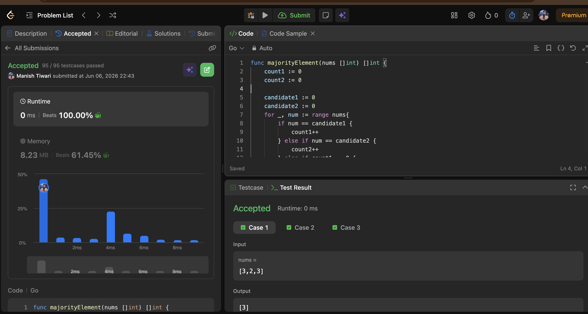
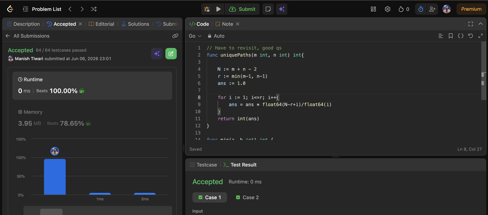
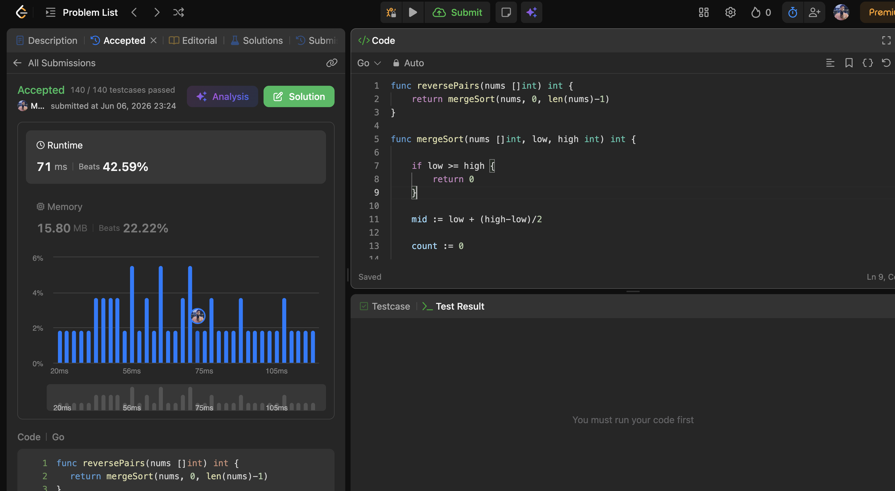

# Day 06

📅 Date: 6 June 2026

## Problems Solved

### 1. Majority Element II

**Platform:** LeetCode

**Difficulty:** Medium

### Approach

Initially considered a HashMap-based frequency counting approach.

Then optimized using the extended version of Moore's Voting Algorithm.

Since at most two elements can appear more than ⌊n/3⌋ times, maintained:

* Candidate 1
* Candidate 2
* Count 1
* Count 2

Performed a second traversal to verify the candidates.

### Complexity

* Time Complexity: O(n)
* Space Complexity: O(1)

### Key Learning

The candidate elimination concept can be extended beyond the classic majority element problem by leveraging frequency constraints.

---

### 2. Unique Paths

**Platform:** LeetCode

**Difficulty:** Medium

### Approach

Instead of generating paths or using Dynamic Programming, observed that each valid path consists of:

* (m - 1) downward moves
* (n - 1) rightward moves

Used combinatorial mathematics to calculate:

C(m+n-2, m-1)

without constructing any paths.

### Complexity

* Time Complexity: O(min(m,n))
* Space Complexity: O(1)

### Key Learning

Many counting problems can be solved mathematically without explicitly generating all possibilities.

---

### 3. Reverse Pairs

**Platform:** LeetCode

**Difficulty:** Hard

### Approach

Applied a modified Merge Sort.

Before merging two sorted halves:

* Counted valid reverse pairs
* Used the condition:

nums[i] > 2 × nums[j]

Then performed a normal merge operation.

### Complexity

* Time Complexity: O(n log n)
* Space Complexity: O(n)

### Key Learning

Merge Sort is not only useful for sorting but can also efficiently count relationships between elements while maintaining sorted order.

---

## Concepts Practiced

✔ Extended Moore's Voting

✔ Candidate Elimination

✔ Combinatorics

✔ Mathematical Counting

✔ Merge Sort

✔ Divide and Conquer

✔ Reverse Pair Counting

✔ Optimization Techniques

---

## Day Summary

Today's problems focused heavily on optimization and mathematical reasoning.

The most interesting realization was that many seemingly difficult problems become manageable once the underlying structure is identified:

* Frequency constraints → Moore's Voting
* Path counting → Combinatorics
* Pair counting → Merge Sort

Understanding these transformations is often more valuable than memorizing implementations.

---

## Statistics

Problems Solved Today: 3

Total Problems Solved So Far: 18

Days Completed: 6/45

---

## Screenshots

### Majority Element II

### Unique Paths

### Reverse Pairs

