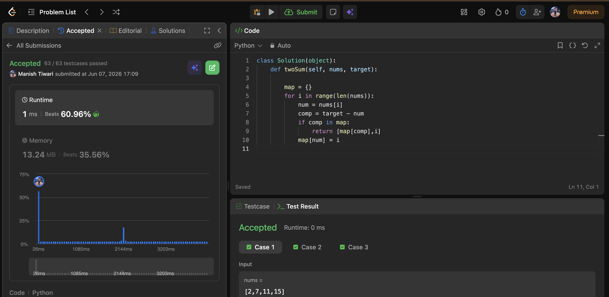
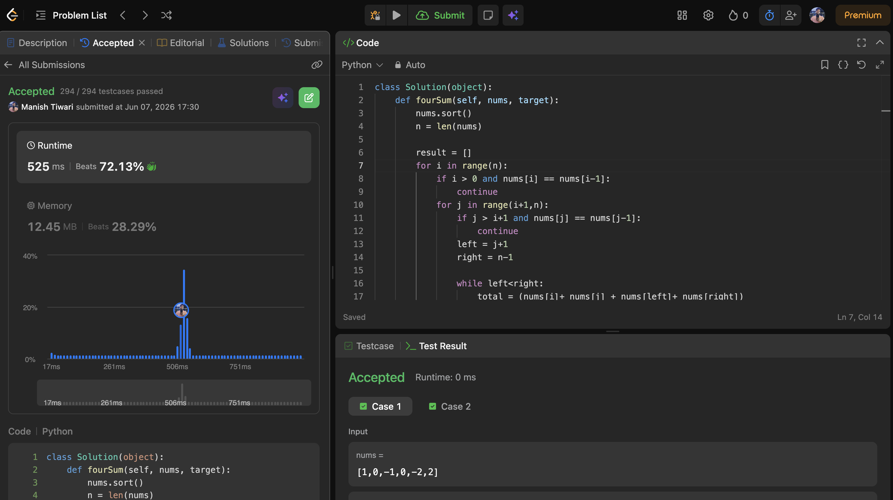
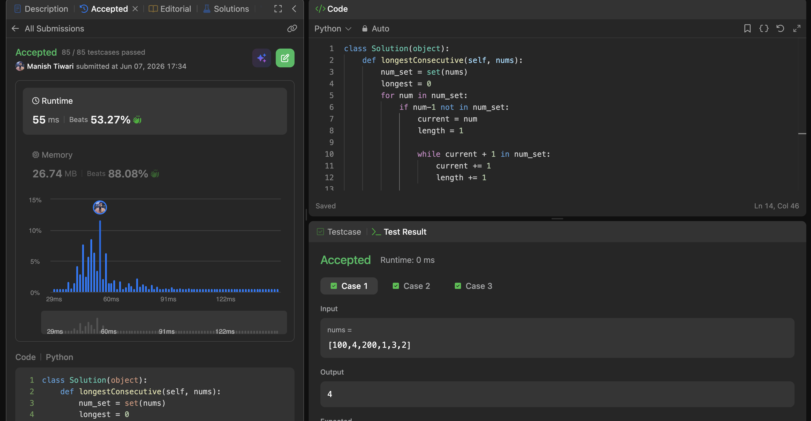

# Day 07

📅 Date: 7 June 2026

## Problems Solved

### 1. Two Sum

**Platform:** LeetCode

**Difficulty:** Easy

### Approach

Started with the brute-force idea of checking every pair.

Optimized using a HashMap where each number is stored along with its index.

For every element, searched for its complement:

target - currentElement

If the complement already existed in the HashMap, the answer was found immediately.

### Complexity

* Time Complexity: O(n)
* Space Complexity: O(n)

### Key Learning

Hashing allows constant-time lookups and is one of the most effective ways to optimize search problems.

---

### 2. Four Sum

**Platform:** LeetCode

**Difficulty:** Medium

### Approach

Sorted the array first.

Fixed two elements using nested loops and then applied the Two Pointer technique on the remaining portion of the array.

Carefully handled duplicate values to avoid repeated quadruplets.

### Complexity

* Time Complexity: O(n³)
* Space Complexity: O(1) (excluding output)

### Key Learning

Many k-sum problems become manageable after sorting and applying pointer-based techniques.

---

### 3. Longest Consecutive Sequence

**Platform:** LeetCode

**Difficulty:** Medium

### Approach

Stored all numbers inside a HashSet.

Only started counting a sequence when the previous number:

num - 1

was not present.

This ensured that each sequence was processed exactly once.

### Complexity

* Time Complexity: O(n)
* Space Complexity: O(n)

### Key Learning

HashSets can eliminate sorting requirements and enable linear-time solutions.

---

## Concepts Practiced

✔ HashMap

✔ HashSet

✔ Two Pointer Technique

✔ Sorting

✔ Duplicate Handling

✔ Sequence Detection

✔ Search Optimization

---

## Day Summary

Today's problems emphasized how the choice of data structure directly affects performance.

The most important realization was that many brute-force solutions can be transformed into efficient algorithms simply by organizing data appropriately.

Examples:

* HashMap → Fast lookups
* HashSet → Fast existence checks
* Sorting → Efficient pointer movement

Understanding when to use these tools is becoming increasingly important as the problems grow more complex.

---

## Statistics

Problems Solved Today: 3

Total Problems Solved So Far: 21

Days Completed: 7/45

---

## Screenshots

### Two Sum

### Four Sum

### Longest Consecutive Sequence

