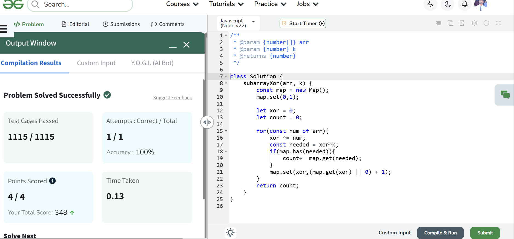
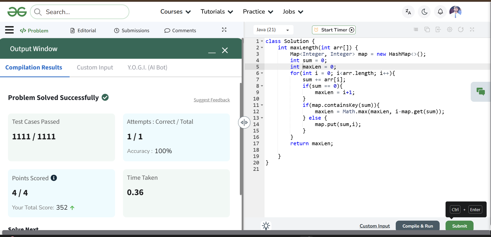
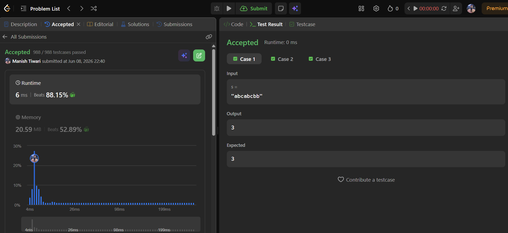

# Day 08

📅 Date: 8 June 2026

## Problems Solved

### 1. Count Number of Subarrays with XOR K

**Pattern:** Prefix XOR + HashMap

### Approach

Started with the brute-force approach of generating all subarrays and calculating XOR values.

Optimized by storing prefix XOR frequencies in a HashMap.

For every prefix XOR value:

needed = currentXor ^ K

If the needed value had already appeared, it indicated the existence of valid subarrays ending at the current index.

### Complexity

* Time Complexity: O(n)
* Space Complexity: O(n)

### Key Learning

Prefix XOR behaves similarly to Prefix Sum and allows subarray problems to be solved efficiently using hashing.

---

### 2. Length of the Longest Subarray with Zero Sum

**Pattern:** Prefix Sum + HashMap

### Approach

Maintained a running prefix sum.

Whenever the same prefix sum appeared again, the elements between the two occurrences formed a subarray with sum zero.

Stored the first occurrence of every prefix sum to maximize subarray length.

### Complexity

* Time Complexity: O(n)
* Space Complexity: O(n)

### Key Learning

Repeated prefix sums reveal hidden zero-sum subarrays and enable linear-time solutions.

---

### 3. Longest Substring Without Repeating Characters

**Pattern:** Sliding Window

### Approach

Used two pointers:

* Left
* Right

Maintained a valid window containing only unique characters.

Whenever a duplicate character appeared, moved the left pointer accordingly to restore validity.

Tracked the maximum window length throughout the traversal.

### Complexity

* Time Complexity: O(n)
* Space Complexity: O(n)

### Key Learning

Sliding Window is a powerful technique for substring and subarray optimization problems.

---

## Concepts Practiced

✔ Prefix XOR

✔ Prefix Sum

✔ HashMap

✔ Sliding Window

✔ Two Pointer Technique

✔ Frequency Tracking

✔ Window Optimization

---

## Day Summary

Today's problems emphasized the importance of storing previously computed information instead of recomputing it repeatedly.

The biggest takeaway was understanding how:

* Prefix XOR helps count subarrays efficiently.
* Prefix Sum identifies hidden relationships between indices.
* Sliding Window dynamically maintains valid ranges.

All three problems demonstrated how auxiliary data structures can transform quadratic solutions into linear-time algorithms.

---

## Statistics

Problems Solved Today: 3

Total Problems Solved So Far: 24

Days Completed: 8/45

---

## Screenshots

### Count Number of Subarrays with XOR K

### Longest Subarray with Zero Sum

### Longest Substring Without Repeating Characters

