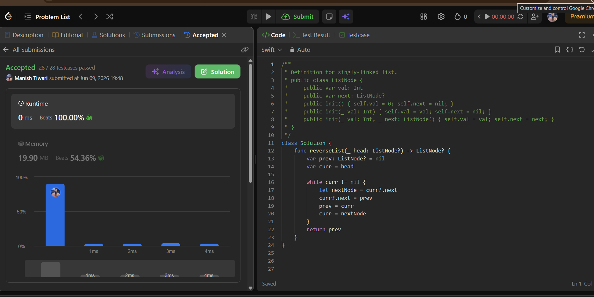
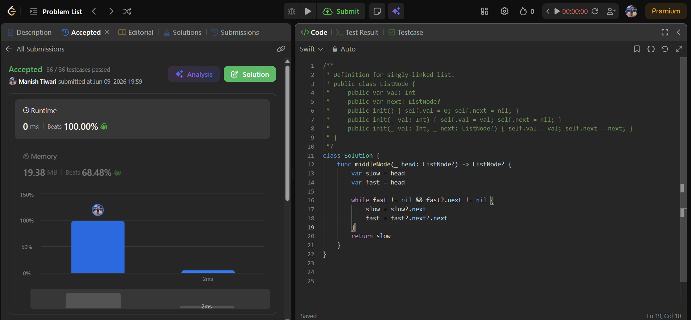
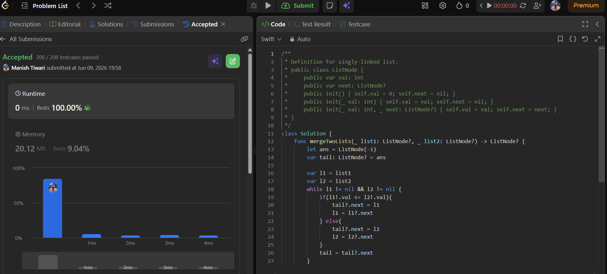

# Day 09

📅 Date: 9 June 2026

## Problems Solved

### 1. Reverse Linked List

**Platform:** LeetCode

**Difficulty:** Easy

### Approach

Started by understanding brute-force approaches using extra storage such as arrays and stacks.

The optimal solution uses three pointers:

- prev
- curr
- next

At each step, the current node's next pointer is reversed and the pointers are moved forward.

### Complexity

- Time Complexity: O(n)
- Space Complexity: O(1)

### Key Learning

Pointer manipulation is the foundation of linked list problems. Understanding how references change is more important than memorizing code.

---

### 2. Middle of the Linked List

**Platform:** LeetCode

**Difficulty:** Easy

### Approach

Considered counting the length of the linked list first and then traversing again to reach the middle node.

Optimized using the Fast and Slow Pointer technique:

- Slow pointer moves one step.
- Fast pointer moves two steps.

When the fast pointer reaches the end, the slow pointer automatically reaches the middle.

### Complexity

- Time Complexity: O(n)
- Space Complexity: O(1)

### Key Learning

Fast and Slow Pointers provide elegant one-pass solutions for many linked list problems.

---

### 3. Merge Two Sorted Lists

**Platform:** LeetCode

**Difficulty:** Easy

### Approach

Compared brute-force approaches involving arrays and sorting.

The optimal solution uses:

- Dummy Node
- Tail Pointer

At every step, the smaller node is attached to the result list and the corresponding pointer moves forward.

### Complexity

- Time Complexity: O(m + n)
- Space Complexity: O(1)

### Key Learning

Using a Dummy Node simplifies linked list construction and removes many edge cases.

---

## Concepts Practiced

✔ Linked List Traversal

✔ Pointer Manipulation

✔ Fast & Slow Pointers

✔ Dummy Node Technique

✔ In-place Reversal

✔ Iterative Linked List Processing

---

## Day Summary

Today's problems focused entirely on understanding how nodes are connected and manipulated.

The most important realization was that many linked list problems become straightforward once pointer movement is visualized carefully.

Key patterns learned:

- Reversal Pattern
- Fast & Slow Pointer Pattern
- Dummy Node Pattern

These patterns form the foundation for advanced linked list problems later in the SDE Sheet.

---

## Statistics

Problems Solved Today: 3

Total Problems Solved So Far: 27

Days Completed: 9/45

---

## Screenshots

### Reverse Linked List

### Middle of the Linked List

### Merge Two Sorted Lists

