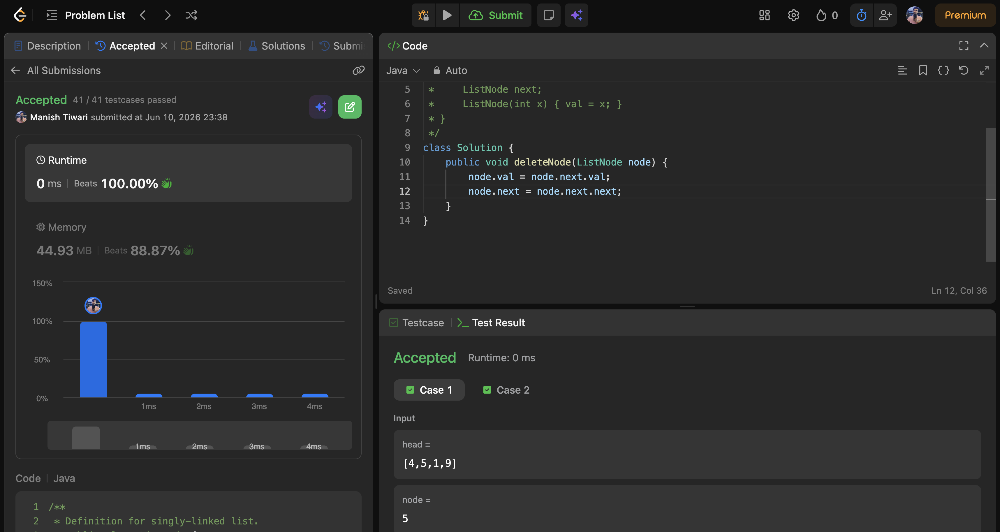
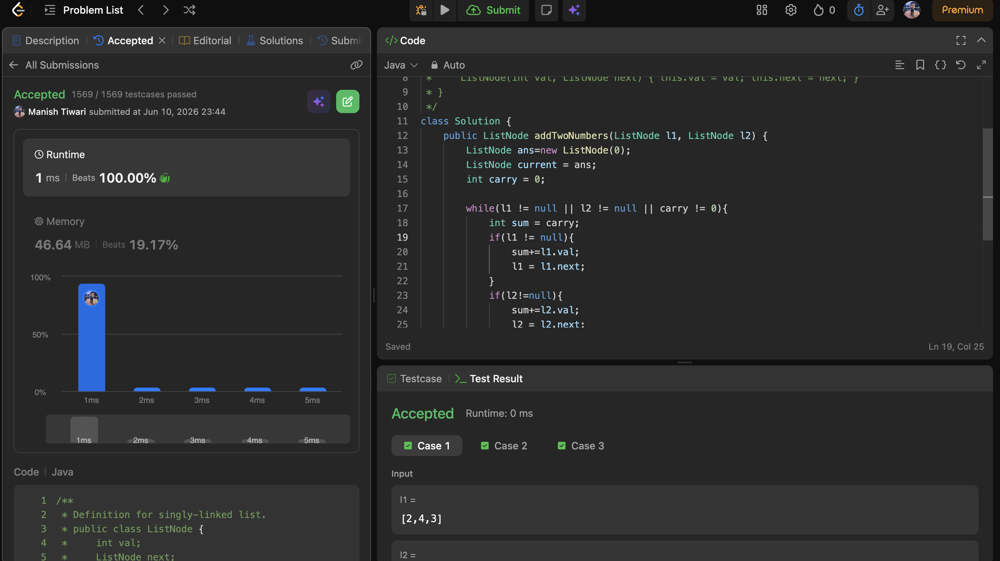
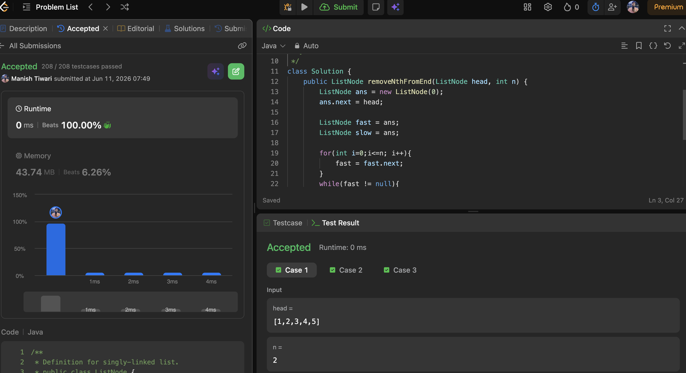

# Day 10

📅 Date: 10 June 2026

## Problems Solved

### 1. Delete Node in a Linked List

**Platform:** LeetCode

**Difficulty:** Medium

### Approach

Unlike standard deletion problems, the previous node is not available.

To delete the given node:

1. Copy the value of the next node into the current node.
2. Skip the next node by updating the pointer.

This effectively removes the target node from the linked list.

### Complexity

- Time Complexity: O(1)
- Space Complexity: O(1)

### Key Learning

Sometimes a problem becomes easier when we modify the current node instead of trying to access unavailable information.

---

### 2. Add Two Numbers

**Platform:** LeetCode

**Difficulty:** Medium

### Approach

Simulated elementary-school addition.

Maintained:

- Carry
- Current Node
- Dummy Node

At each step:

- Add corresponding digits.
- Create a new node using sum % 10.
- Update carry using sum / 10.

### Complexity

- Time Complexity: O(max(n, m))
- Space Complexity: O(max(n, m))

### Key Learning

Many linked list arithmetic problems can be solved by simulating real-world number operations.

---

### 3. Remove Nth Node From End of List

**Platform:** LeetCode

**Difficulty:** Medium

### Approach

Used the Fast and Slow Pointer technique.

Steps:

1. Created a Dummy Node.
2. Moved Fast pointer (n + 1) steps ahead.
3. Moved both pointers together.
4. When Fast reached the end, Slow pointed just before the node to remove.

### Complexity

- Time Complexity: O(n)
- Space Complexity: O(1)

### Key Learning

Maintaining a fixed gap between pointers helps locate positions from the end in a single traversal.

---

## Concepts Practiced

✔ Linked Lists

✔ Fast & Slow Pointers

✔ Dummy Node Technique

✔ Carry Handling

✔ Pointer Manipulation

✔ Single Pass Traversal

✔ In-place Updates

---

## Day Summary

Today's problems strengthened my understanding of linked list operations and pointer movement.

The most valuable insight was learning how small pointer manipulations can solve problems efficiently without requiring additional data structures.

Key patterns reinforced:

- Copy & Skip
- Dummy Node
- Fast & Slow Pointer
- Carry Simulation

These patterns are frequently used in medium and hard linked list interview questions.

---

## Statistics

Problems Solved Today: 3

Total Problems Solved So Far: 30

Days Completed: 10/45

---

## Screenshots

### Delete Node in a Linked List

### Add Two Numbers

### Remove Nth Node From End

