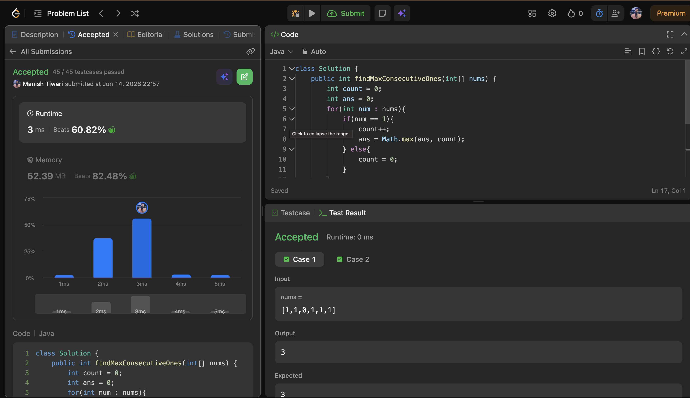
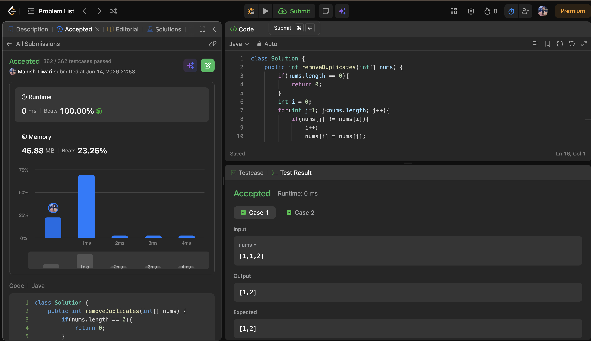
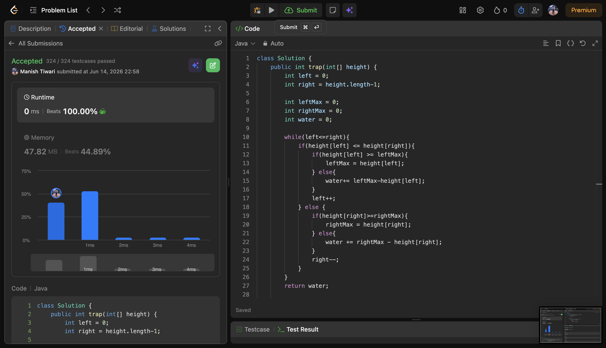

# Day 14

📅 Date: 14 June 2026

## Problems Solved

### 1. Max Consecutive Ones

**Platform:** LeetCode

**Difficulty:** Easy

### Approach

Used a single traversal approach.

Maintained:

- Current consecutive count
- Maximum count seen so far

Whenever a 0 was encountered, the current count was reset.

### Complexity

- Time Complexity: O(n)
- Space Complexity: O(1)

### Key Learning

Many array problems can be solved efficiently using a running count instead of storing additional information.

---

### 2. Remove Duplicates from Sorted Array

**Platform:** LeetCode

**Difficulty:** Easy

### Approach

Used the Two Pointer technique.

- One pointer tracked the last unique element.
- Another pointer traversed the array.

Whenever a new unique element was found, it was placed at the next valid position.

### Complexity

- Time Complexity: O(n)
- Space Complexity: O(1)

### Key Learning

Sorted arrays often allow in-place solutions using read and write pointers.

---

### 3. Trapping Rain Water

**Platform:** LeetCode

**Difficulty:** Hard

### Approach

Explored brute-force and prefix/suffix maximum approaches.

The optimal solution used Two Pointers:

- Left Pointer
- Right Pointer
- Left Maximum
- Right Maximum

At every step, the smaller boundary determined the amount of water that could be trapped.

### Complexity

- Time Complexity: O(n)
- Space Complexity: O(1)

### Key Learning

The key insight is that trapped water at a position depends on the minimum of the tallest boundaries on both sides.

---

## Concepts Practiced

✔ Array Traversal

✔ Running Count Pattern

✔ Two Pointers

✔ Read & Write Pointers

✔ Prefix Maximum Concept

✔ Space Optimization

✔ Trapping Rain Water Logic

---

## Day Summary

Today's problems focused heavily on efficient array processing and pointer-based optimization.

The most valuable takeaway was understanding how maintaining the right information during traversal can eliminate the need for extra arrays and reduce space complexity.

Key patterns reinforced:

- Running Count
- Two Pointers
- Boundary-Based Computation

---

## Statistics

Problems Solved Today: 3

Total Problems Solved So Far: 42

Days Completed: 14/45

---

## Screenshots

### Max Consecutive Ones

### Remove Duplicates from Sorted Array

### Trapping Rain Water

