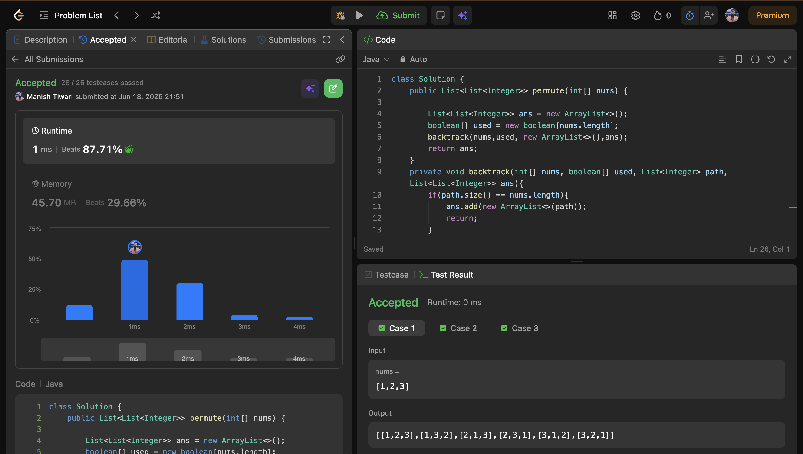
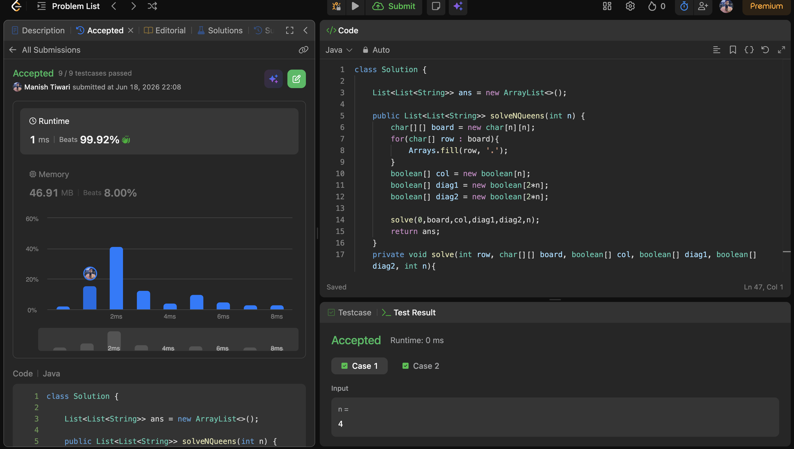
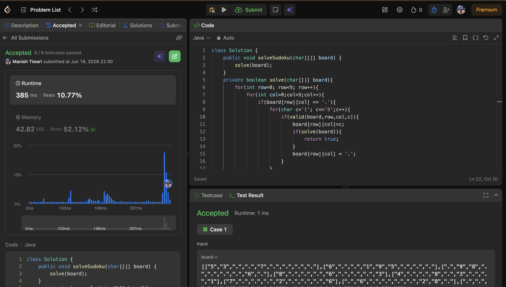

# Day 18

📅 Date: 18 June 2026

## Problems Solved

### 1. Permutations

**Platform:** LeetCode

**Difficulty:** Medium

### Approach

Used Backtracking with a Visited Array.

For every position:

- Pick an unused element.
- Add it to the current permutation.
- Recursively generate remaining positions.
- Backtrack by removing the element and marking it unused.

### Complexity

- Time Complexity: O(n!)
- Space Complexity: O(n)

### Key Learning

Permutations introduce the fundamental Backtracking pattern:

Choose → Explore → Undo

---

### 2. N-Queens

**Platform:** LeetCode

**Difficulty:** Hard

### Approach

Placed one queen per row.

For each row:

- Try every column.
- Check whether placing a queen is safe.
- If safe, place the queen and move to the next row.
- If no valid placement exists, backtrack.

Optimized safety checks using:

- Column Array
- Main Diagonal Array
- Anti-Diagonal Array

### Complexity

- Time Complexity: O(N!)
- Space Complexity: O(N)

### Key Learning

Constraint-based Backtracking can drastically reduce unnecessary exploration.

---

### 3. Sudoku Solver

**Platform:** LeetCode

**Difficulty:** Hard

### Approach

For every empty cell:

- Try digits from 1 to 9.
- Check whether placement is valid.
- Continue recursively.
- If a dead end is reached, remove the digit and try another.

The board is solved when no empty cells remain.

### Complexity

- Time Complexity: Exponential
- Space Complexity: O(81)

### Key Learning

Sudoku is a classic Constraint Satisfaction Problem solved efficiently using Backtracking.

---

## Concepts Practiced

✔ Recursion

✔ Backtracking

✔ Permutation Generation

✔ Constraint Satisfaction

✔ State Modification

✔ Undo Operations

✔ Board-Based Search

✔ Pruning

---

## Day Summary

Today's problems marked the transition from basic recursion to full Backtracking.

The most important realization was that all Backtracking problems follow the same framework:

1. Make a Choice
2. Explore Recursively
3. Undo the Choice

This pattern was applied across:

- Permutations
- N-Queens
- Sudoku Solver

Understanding this framework makes advanced Backtracking problems significantly easier to approach.

---

## Statistics

Problems Solved Today: 3

Total Problems Solved So Far: 57

Days Completed: 18/45

---

## Screenshots

### Permutations

### N-Queens

### Sudoku Solver

