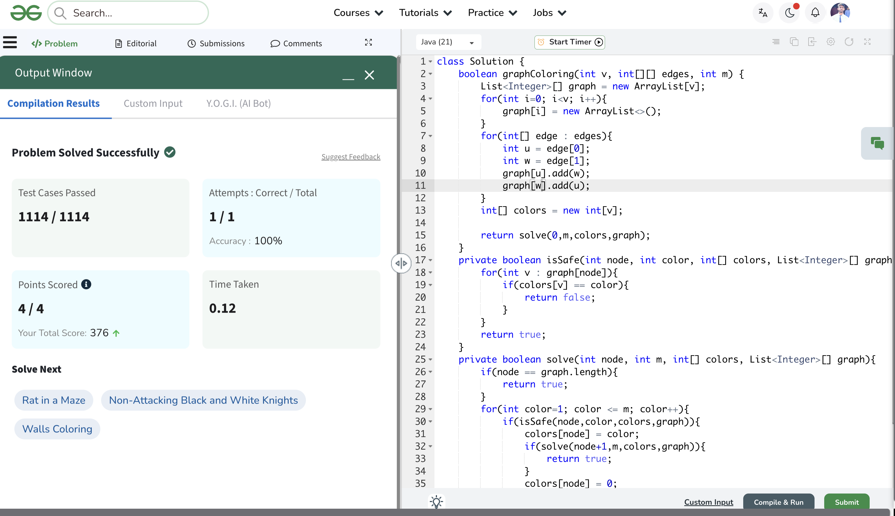
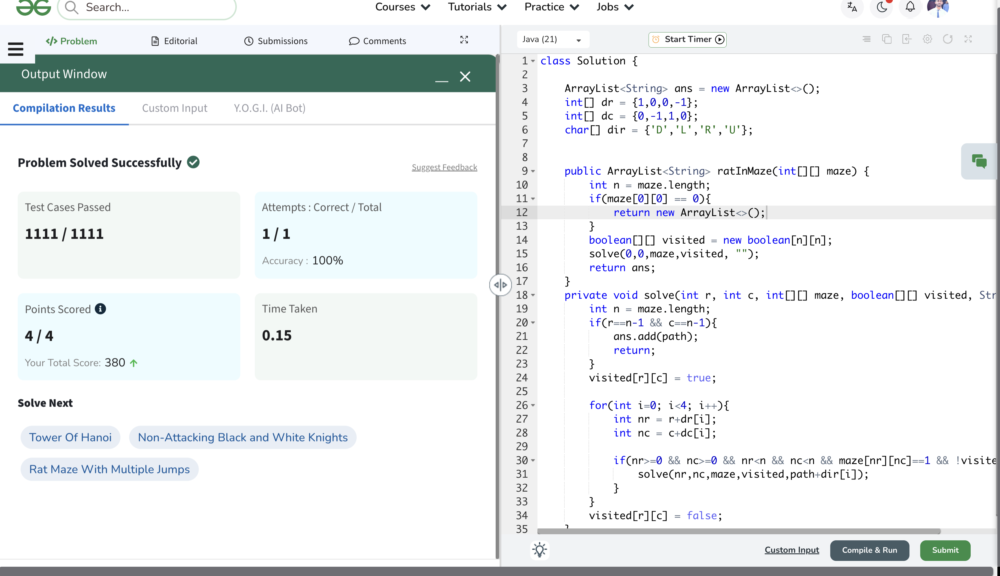
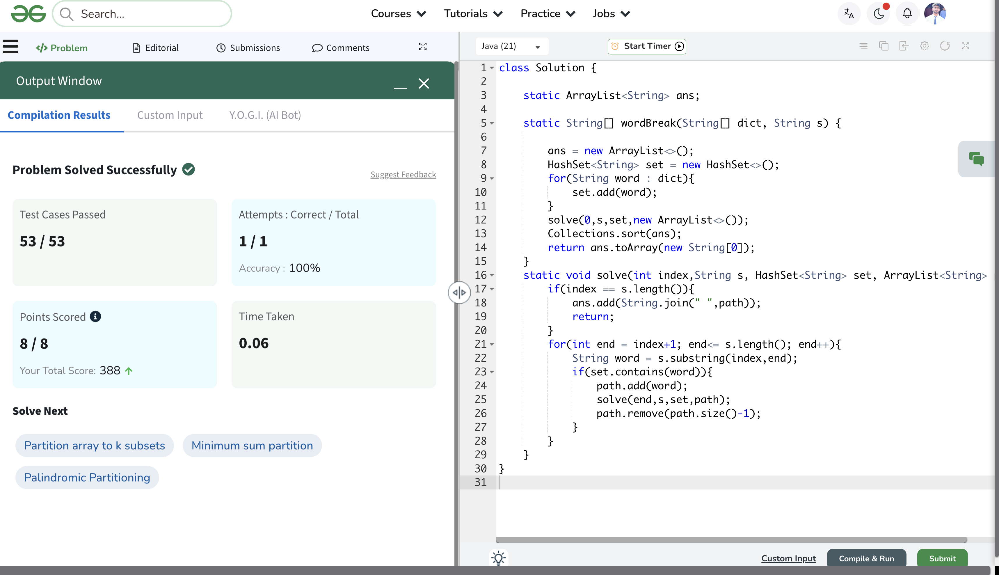

# Day 19

📅 Date: 19 June 2026

## Problems Solved

### 1. M-Coloring Problem

**Platform:** GeeksforGeeks

**Difficulty:** Medium

### Approach

Used Backtracking to assign colors to graph vertices.

For every vertex:

- Try each color from 1 to M.
- Check whether assigning that color violates any adjacency constraint.
- If safe, assign the color and move to the next vertex.
- If a conflict occurs later, backtrack and try another color.

### Complexity

- Time Complexity: O(M^V)
- Space Complexity: O(V)

### Key Learning

Graph coloring is a classic Constraint Satisfaction Problem where every choice must satisfy previously established constraints.

---

### 2. Rat in a Maze

**Platform:** GeeksforGeeks

**Difficulty:** Medium

### Approach

Used Backtracking to generate all valid paths from the source to destination.

For every cell:

- Try moving Down, Left, Right, and Up.
- Visit only valid and unvisited cells.
- Record the movement path.
- Backtrack after exploring each direction.

### Complexity

- Time Complexity: Exponential
- Space Complexity: O(N²)

### Key Learning

Grid traversal problems often rely on maintaining visited states and undoing decisions during backtracking.

---

### 3. Word Break II

**Platform:** GeeksforGeeks

**Difficulty:** Hard

### Approach

Used String Backtracking.

At every index:

- Generated all possible substrings.
- Checked whether the substring existed in the dictionary.
- Added valid words to the current sentence.
- Recursively solved the remaining suffix.
- Backtracked after exploring each possibility.

Used a HashSet for O(1) dictionary lookup.

### Complexity

- Time Complexity: Exponential
- Space Complexity: O(N)

### Key Learning

String partitioning problems can often be modeled as recursive decision trees where every valid split creates a new branch.

---

## Concepts Practiced

✔ Backtracking

✔ Constraint Satisfaction

✔ Graph Coloring

✔ Grid Traversal

✔ Visited State Tracking

✔ String Partitioning

✔ HashSet Optimization

✔ Path Generation

---

## Day Summary

Today's problems strengthened my understanding of Backtracking across different domains:

- Graphs (M-Coloring)
- Grids (Rat in a Maze)
- Strings (Word Break II)

The most valuable insight was realizing that despite appearing different, all three problems follow the same recursive framework:

1. Make a Choice
2. Validate the Choice
3. Explore Recursively
4. Undo the Choice

This pattern is the foundation of many advanced recursion and backtracking problems.

---

## Statistics

Problems Solved Today: 3

Total Problems Solved So Far: 60

Days Completed: 19/45

---

## Screenshots

### M-Coloring Problem

### Rat in a Maze

### Word Break II

